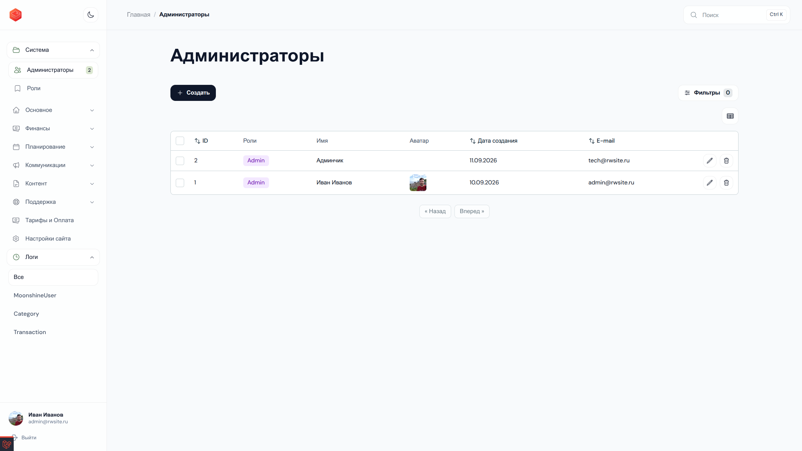
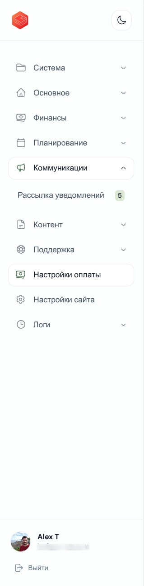

# MoonShine Mushrooms Theme

A modern, lightweight theme for
[MoonShine 4](https://moonshine-laravel.com/) with a calm color palette,
compact navigation, and a clean workspace. It is completely independent of
your application's models, resources, and business logic.




## Features

- Minimal interface with subtle color accents
- Compact sidebar with a pinned user profile
- Refined header, breadcrumbs, and mobile navigation
- Consistent styling for tables, forms, buttons, tabs, and notifications
- Light and dark color palettes
- Automatic CSS cache busting without manually changing query parameters
- Extendable layout with no dependency on application resources or menus


### Navigation and user profile



## Requirements

- PHP 8.3 or newer
- MoonShine 4.8 or newer


## Installation

Install the package:

```bash
composer require tikhomirov/moonshine-mushrooms-theme
```

Publish its configuration and assets:

```bash
php artisan vendor:publish --tag=moonshine-mushrooms-theme-config
php artisan vendor:publish --tag=moonshine-mushrooms-theme-assets --force
```

Configure the layout and palette in `config/moonshine.php`:

```php
use Tikhomirov\MoonShineMushroomsTheme\Layouts\MushroomsThemeLayout;
use Tikhomirov\MoonShineMushroomsTheme\Palettes\MushroomsPalette;

return [
    // ...
    'layout' => MushroomsThemeLayout::class,
    'palette' => MushroomsPalette::class,
];
```

Clear the configuration cache:

```bash
php artisan optimize:clear
```

Open your MoonShine panel and refresh the page.

## Extending the layout

The theme does not register menu items or depend on your application
resources. Extend the package layout when your project needs a custom menu:

```php
<?php

declare(strict_types=1);

namespace App\MoonShine\Layouts;

use App\MoonShine\Resources\User\UserResource;
use MoonShine\MenuManager\MenuItem;
use Tikhomirov\MoonShineMushroomsTheme\Layouts\MushroomsThemeLayout;

final class MoonShineLayout extends MushroomsThemeLayout
{
    protected function menu(): array
    {
        return [
            ...parent::menu(),
            MenuItem::make(UserResource::class),
        ];
    }
}
```

Then set `App\MoonShine\Layouts\MoonShineLayout::class` as the layout in
`config/moonshine.php`.

## Configuration

The published `config/mushrooms-theme.php` file contains the asset paths:

```php
return [
    'css_path' => '/vendor/moonshine-mushrooms-theme/admin.css',
    'avatar_preview_path' => '/vendor/moonshine-mushrooms-theme/avatar-preview.js',
];
```

The layout registers both assets automatically. Avatar upload and display are
handled by MoonShine itself; the theme only adds an instant preview when a new
avatar file is selected.

## Updating

```bash
composer update tikhomirov/moonshine-mushrooms-theme
php artisan vendor:publish --tag=moonshine-mushrooms-theme-assets --force
php artisan optimize:clear
```

The theme versions its CSS using the modification time of the published file.
After an update, browsers receive a new asset URL instead of reusing stale
cached CSS.

## Theme development

Clone the repository and install its dependencies:

```bash
git clone git@github.com:tikhomirov/moonshine-mushrooms-theme.git
cd moonshine-mushrooms-theme
composer install
```

For development inside a Laravel application, configure this repository as a
Composer `path` package or add its namespace to the application's
`autoload-dev` section. Serve the assets through a local symlink to see PHP,
Blade, CSS, and JavaScript changes without publishing a new package version.

Source structure:

- `src/Layouts/MushroomsThemeLayout.php` — layout structure
- `src/Palettes/MushroomsPalette.php` — color palette
- `resources/css/admin.css` — theme styles
- `resources/views/` — layout Blade templates
- `resources/avatar-preview.js` — instant avatar file preview


## License

MoonShine Mushrooms Theme is open-source software licensed under the
[MIT license](LICENSE).
